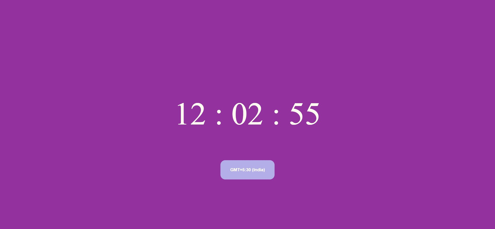

# ⌛ TypeScript-Clock ⏰ 
***Basic digital clock made using HTML/CSS and TypeScript, since the most precious resource we all have is time.***

#   Time is the wisest counselor of all. 

## Steps after cloning: ✂📋
### 👉🏻Step-1
- Install Node.js. It is used to setup TypeScript on our local computer.
---
- To verify the installation was successful, enter the following command in the Terminal Window.
```
$ node -v  
$ npm -v  
```
### 👉🏻Step-2
- Install TypeScript. To install TypeScript, enter the following command in the Terminal Window.
```
$ npm install typescript --save-dev         //As dev dependency  
$ npm install typescript -g                 //Install as a global module  
$ npm install typescript@latest -g          //Install latest if you have an older version
```
### 👉🏻Step-3 
- To verify the installation was successful, enter the following command in the Terminal Window.
```
$ tsc -v
```
### 👉🏻Step-4
```
cd TypeScript-Clock
```
- ***Transpiling TypeScript file into JavaScript using TypeScript Compiler***
```
tsc app.ts --outFile app.js
```


<details>
  <summary><strong>👇🏻 Click here for Output Display Screen 👨🏻‍💻 : </strong></summary>
  <p align="center">
    
  </p>
</details>
